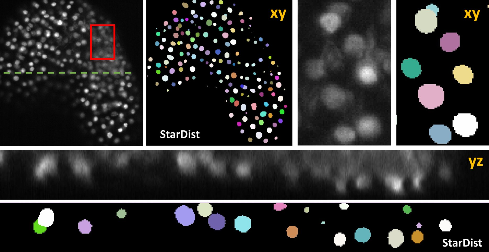

# model_zoo

## Description of model:

# StarDist:

## 3D_Iso_Basic

**used in:**

https://www.biorxiv.org/content/10.1101/2020.04.29.068023v1

**based on:**

We pre-trained a StarDist 3D model using the annotation of a *Arabidopsis thaliana* lateral root nuclei dataset provided in (Wolny et al., 2020) and https://github.com/wolny/pytorch-3dunet.

Wolny, A., Cerrone, L., Vijayan, A., Tofanelli, R., Barro, A.V., Louveaux, M., et al. (2020). Accurate and versatile 3D segmentation of plant tissues at cellular resolution. *eLife* 9**,** e57613. doi: 10.7554/eLife.57613.

**tested with:**

*Arabidopsis flowers*

H2B:mRuby2 was used for the visualization of somatic nuclei of *Arabidopsis thaliana* flower. The flower was scanned from eight views differing by 45° increments in a Zeiss Z1 light-sheet microscope (Valuchova et al., 2020). We used a single view to mimic a challenging 3D segmentation problem. Image files are available in the Image Data Resource (Williams et al., 2017) under the accession code: idr0077.

Valuchova, S., Mikulkova, P., Pecinkova, J., Klimova, J., Krumnikl, M., Bainar, P., et al. (2020). Imaging plant germline differentiation within Arabidopsis flowers by light sheet microscopy. *Elife* 9. doi: 10.7554/eLife.52546.

and

Williams, E., Moore, J., Li, S.W., Rustici, G., Tarkowska, A., Chessel, A., et al. (2017). The Image Data Resource: A Bioimage Data Integration and Publication Platform. *Nat Methods* 14(8)**,** 775-781. doi: 10.1038/nmeth.4326.

**Sample results:**

Volume segmentation. In all images, segmented nuclei are assigned a unique random color.   Side-by-side comparison of segmented somatic nuclei of *Arabidopsis thaliana* flowers obtained with the 3D_Iso_Basic model that was trained on a similar dataset. The red box marks the area that is shown enlarged in the right panel. The green line indicates the location of the yz-plane shown in below.
